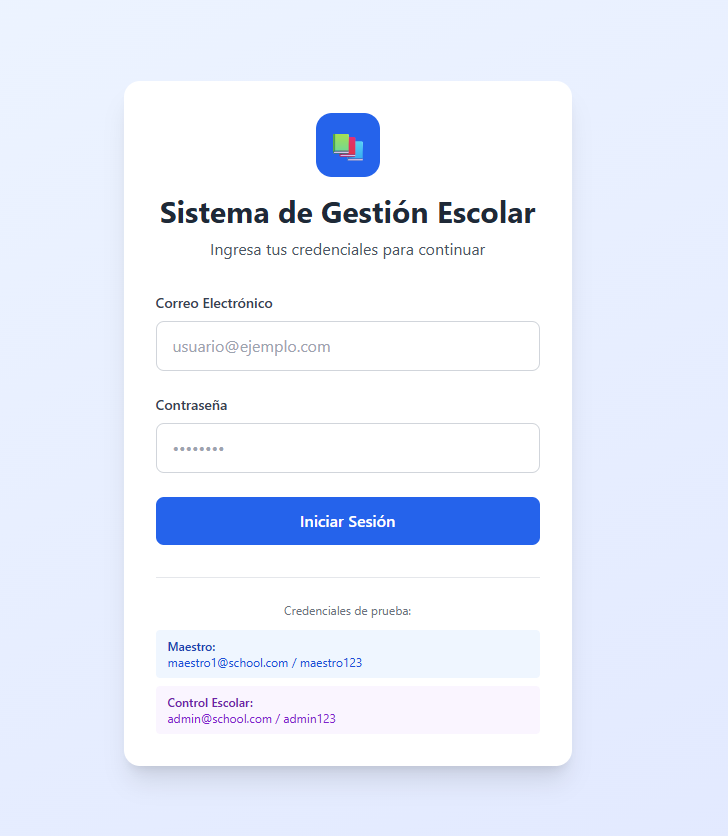
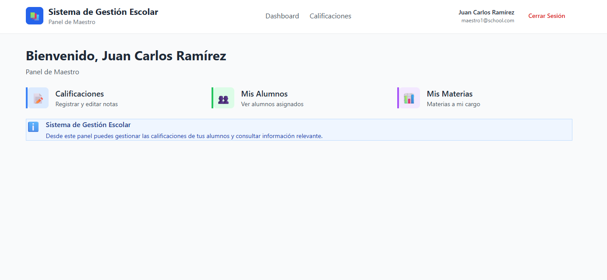
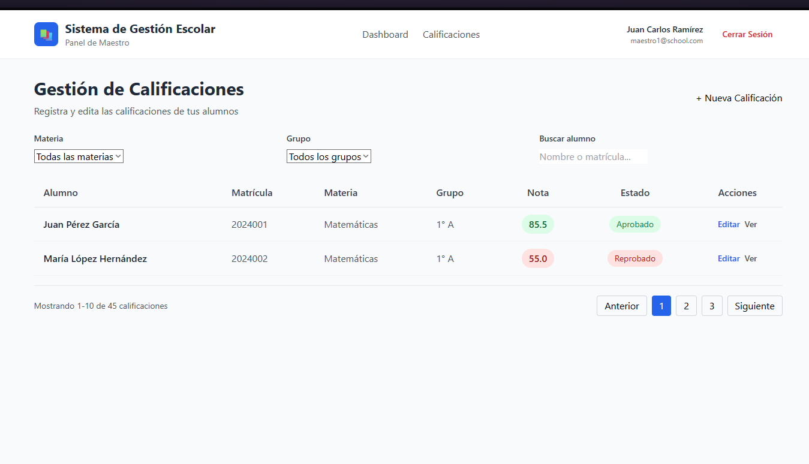
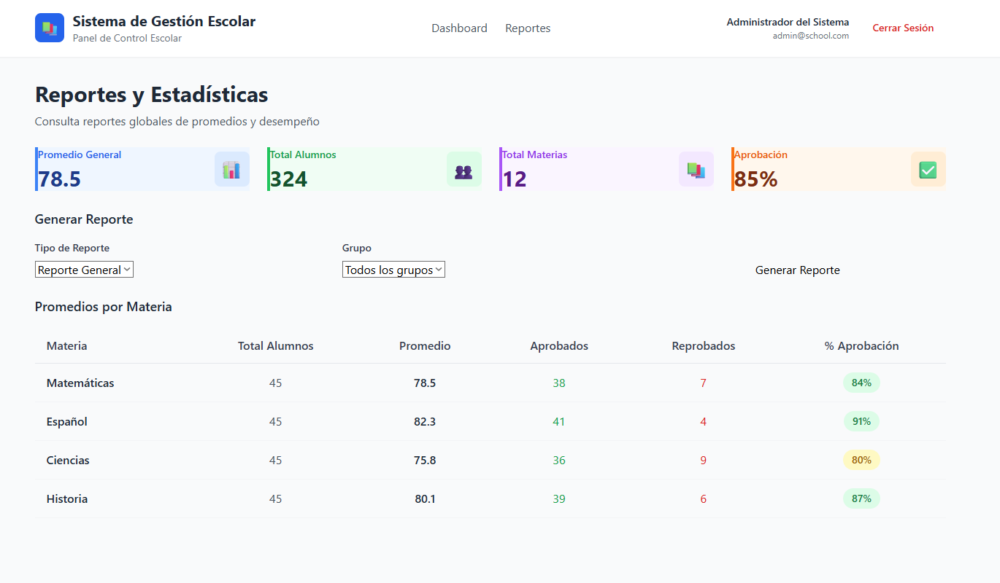

# 🎓 Sistema de Gestión Escolar - Frontend

Cliente web moderno para el sistema de gestión y reporte de calificaciones escolares. Interfaz intuitiva y responsive que permite a maestros y administradores gestionar calificaciones de forma eficiente.

[](https://reactjs.org/)
[](https://www.typescriptlang.org/)
[](https://vitejs.dev/)
[](https://tailwindcss.com/)
[](LICENSE)

---

## 📋 Tabla de Contenidos

- [Características](#características)
- [Stack Tecnológico](#stack-tecnológico)
- [Requisitos Previos](#requisitos-previos)
- [Instalación](#instalación)
- [Configuración](#configuración)
- [Uso](#uso)
- [Funcionalidades por Rol](#funcionalidades-por-rol)
- [Docker](#docker)
- [Estructura del Proyecto](#estructura-del-proyecto)
- [Scripts Disponibles](#scripts-disponibles)

---

## ✨ Características

- ✅ **Interfaz moderna** con Tailwind CSS
- ✅ **TypeScript** para type safety
- ✅ **Autenticación JWT** completa
- ✅ **Rutas protegidas** por rol
- ✅ **Context API** para estado global
- ✅ **Custom Hooks** reutilizables
- ✅ **Responsive Design** (mobile-first)
- ✅ **Interceptores Axios** para JWT automático
- ✅ **Dashboard personalizado** por rol
- ✅ **Manejo de errores** robusto

---

## 🚀 Stack Tecnológico

| Tecnología | Versión | Propósito |
|------------|---------|-----------|
| React | 18.2 | UI Library |
| TypeScript | 5.3 | Tipado estático |
| Vite | 5.0 | Build tool |
| React Router | 6.21 | Routing |
| Axios | 1.6 | HTTP Client |
| Tailwind CSS | 3.4 | Estilos |

---

## 📦 Requisitos Previos

- **Node.js** >= 18.0.0 ([Descargar](https://nodejs.org/))
- **npm** >= 9.0.0 (incluido con Node.js)
- **Backend API** corriendo ([Ver repositorio](https://github.com/tu-usuario/school_management_backend))

---

## 🔧 Instalación

### 1. Clonar el Repositorio

```bash
git clone https://github.com/tu-usuario/school_management_frontend.git
cd school_management_frontend
```

### 2. Instalar Dependencias

```bash
npm install
```

### 3. Configurar Variables de Entorno

```bash
cp .env.example .env
```

Edita el archivo `.env`:

```env
# URL del Backend API
VITE_API_URL=http://localhost:3000/api

# Nombre de la aplicación
VITE_APP_NAME=Sistema de Gestión Escolar
```

### 4. Iniciar en Desarrollo

```bash
npm run dev
```

**Aplicación corriendo en:** `http://localhost:5173`

---

## ⚙️ Configuración

### Variables de Entorno

| Variable | Descripción | Ejemplo | Requerida |
|----------|-------------|---------|-----------|
| `VITE_API_URL` | URL del backend | `http://localhost:3000/api` | ✅ |
| `VITE_APP_NAME` | Nombre de la app | `Sistema de Gestión Escolar` | ❌ |

### Configuración de Tailwind

El proyecto usa Tailwind CSS con configuración personalizada en `tailwind.config.js`:

```javascript
export default {
  content: [
    "./index.html",
    "./src/**/*.{js,ts,jsx,tsx}",
  ],
  theme: {
    extend: {
      colors: {
        primary: {
          // Colores personalizados
        },
      },
    },
  },
  plugins: [],
}
```

---

## 💻 Uso

### Iniciar Sesión

1. Abre `http://localhost:5173/login`
2. Usa las credenciales de prueba:

**Control Escolar:**
- Email: `admin@school.com`
- Password: `admin123`

**Maestro:**
- Email: `maestro1@school.com`
- Password: `maestro123`

### Navegación

Después del login, serás redirigido al Dashboard según tu rol:

**Maestro:**
- Dashboard
- Gestión de Calificaciones
- Lista de Alumnos Asignados

**Control Escolar:**
- Dashboard
- Reportes Globales
- Supervisión de Calificaciones

---

## 👥 Funcionalidades por Rol

### 🎓 Rol: MAESTRO

#### Dashboard
- Vista de resumen personalizada
- Accesos rápidos a funcionalidades

#### Gestión de Calificaciones
- ✅ Ver lista de calificaciones propias
- ✅ Filtrar por materia, alumno o grupo
- ✅ Registrar nuevas calificaciones
- ✅ Editar calificaciones existentes
- ✅ Ver detalle de calificaciones
- ❌ No puede eliminar calificaciones

#### Alumnos
- ✅ Ver alumnos asignados
- ✅ Filtrar por grupo
- ✅ Ver historial de calificaciones por alumno

**Restricciones:**
- Solo puede ver y editar sus propias calificaciones
- No puede acceder a reportes de otros maestros
- No puede eliminar calificaciones

---

### 🏫 Rol: CONTROL_ESCOLAR (Admin)

#### Dashboard
- Vista de resumen ejecutiva
- Estadísticas globales

#### Reportes
- ✅ Reporte general del sistema
- ✅ Reporte por alumno específico
- ✅ Reporte por materia
- ✅ Reporte por grupo
- ✅ Estadísticas de aprobación
- ✅ Promedios globales

#### Supervisión
- ✅ Ver todas las calificaciones del sistema
- ✅ Eliminar calificaciones erróneas (soft delete)
- ✅ Filtrar por maestro, materia, alumno o grupo

**Permisos:**
- Acceso completo a todos los reportes
- Puede eliminar cualquier calificación
- Puede supervisar el trabajo de todos los maestros

---

## 🐳 Docker

### Ejecutar con Docker Compose

```bash
# Levantar servicio
docker-compose up -d

# Ver logs
docker-compose logs -f frontend

# Detener servicio
docker-compose down
```

### Dockerfile

```dockerfile
FROM node:18-alpine
WORKDIR /app
COPY package*.json ./
RUN npm ci
COPY . .
EXPOSE 5173
CMD ["npm", "run", "dev", "--", "--host"]
```

---

## 📁 Estructura del Proyecto

```
src/
├── assets/              # Recursos estáticos
├── components/          # Componentes React
│   ├── common/         # Componentes reutilizables
│   │   ├── Button.tsx
│   │   ├── Input.tsx
│   │   ├── Card.tsx
│   │   ├── Modal.tsx
│   │   ├── Table.tsx
│   │   └── Loading.tsx
│   ├── layout/         # Layout components
│   │   ├── Header.tsx
│   │   ├── Sidebar.tsx
│   │   └── Layout.tsx
│   └── forms/          # Formularios específicos
│       └── CalificacionForm.tsx
├── pages/              # Páginas/Vistas
│   ├── Login.tsx
│   ├── Dashboard.tsx
│   ├── maestro/
│   │   └── CalificacionesPage.tsx
│   └── admin/
│       └── ReportesPage.tsx
├── hooks/              # Custom hooks
│   └── useAuth.ts
├── services/           # Servicios API
│   ├── api.ts
│   ├── authService.ts
│   ├── calificacionService.ts
│   ├── alumnoService.ts
│   └── reporteService.ts
├── context/            # Context API
│   └── AuthContext.tsx
├── types/              # Types TypeScript
│   └── index.ts
├── routes/             # Configuración de rutas
│   ├── AppRoutes.tsx
│   └── PrivateRoute.tsx
├── styles/             # Estilos globales
│   └── index.css
├── utils/              # Utilidades
│   └── formatters.ts
├── App.tsx             # Componente raíz
└── main.tsx            # Entry point
```

---

## 📜 Scripts Disponibles

```bash
# Desarrollo
npm run dev              # Iniciar servidor de desarrollo

# Build
npm run build           # Build para producción
npm run preview         # Preview del build

# Linting
npm run lint            # Verificar código
npm run lint:fix        # Corregir automáticamente

# Formateo
npm run format          # Formatear con Prettier

# Testing
npm test                # Ejecutar tests
```

---

## 🔌 Integración con Backend

### Cliente Axios Configurado

El proyecto incluye un cliente Axios con interceptores automáticos:

```typescript
// src/services/api.ts
import axios from 'axios';

const api = axios.create({
  baseURL: import.meta.env.VITE_API_URL,
  headers: {
    'Content-Type': 'application/json',
  },
});

// Interceptor: Agregar token automáticamente
api.interceptors.request.use((config) => {
  const token = localStorage.getItem('token');
  if (token && config.headers) {
    config.headers.Authorization = `Bearer ${token}`;
  }
  return config;
});

// Interceptor: Manejo de errores
api.interceptors.response.use(
  (response) => response,
  (error) => {
    if (error.response?.status === 401) {
      // Redirigir al login si el token es inválido
      localStorage.removeItem('token');
      window.location.href = '/login';
    }
    return Promise.reject(error);
  }
);

export default api;
```

### Servicios Disponibles

#### authService
```typescript
import { authService } from './services/authService';

// Login
await authService.login({ email, password });

// Obtener perfil
await authService.obtenerPerfil();

// Logout
authService.logout();
```

#### calificacionService
```typescript
import { calificacionService } from './services/calificacionService';

// Obtener calificaciones
await calificacionService.obtenerCalificaciones(filtros);

// Crear calificación
await calificacionService.crearCalificacion(data);

// Actualizar calificación
await calificacionService.actualizarCalificacion(id, data);

// Eliminar calificación
await calificacionService.eliminarCalificacion(id);
```

---

## 🎨 Estilos y Temas

### Tailwind CSS

El proyecto usa Tailwind CSS con clases personalizadas:

```css
/* src/styles/index.css */

/* Botones */
.btn-primary {
  @apply bg-blue-600 text-white px-4 py-2 rounded-lg 
         hover:bg-blue-700 transition-colors duration-200 font-medium;
}

.btn-secondary {
  @apply bg-gray-200 text-gray-800 px-4 py-2 rounded-lg 
         hover:bg-gray-300 transition-colors duration-200 font-medium;
}

/* Inputs */
.input-field {
  @apply w-full px-3 py-2 border border-gray-300 rounded-lg 
         focus:outline-none focus:ring-2 focus:ring-blue-500 
         focus:border-transparent;
}

/* Cards */
.card {
  @apply bg-white rounded-lg shadow-md p-6;
}
```

---

## 🔐 Autenticación y Rutas

### AuthContext

El proyecto usa Context API para manejar la autenticación:

```typescript
import { useAuth } from './hooks/useAuth';

function Component() {
  const { 
    usuario, 
    login, 
    logout, 
    isAuthenticated,
    isMaestro,
    isControlEscolar 
  } = useAuth();

  // Usar en el componente
}
```

### Rutas Protegidas

```typescript
<PrivateRoute requiredRole="MAESTRO">
  <CalificacionesPage />
</PrivateRoute>

<PrivateRoute requiredRole="CONTROL_ESCOLAR">
  <ReportesPage />
</PrivateRoute>
```

---

## 🐛 Troubleshooting

### Error: "Network Error" al hacer login

**Causa:** Backend no está corriendo

**Solución:**
```bash
# Verificar que el backend esté corriendo
curl http://localhost:3000/health

# Si no responde, iniciar el backend
cd school_management_backend
npm run dev
```

### Error: "Cannot find module"

**Causa:** Dependencias no instaladas

**Solución:**
```bash
rm -rf node_modules package-lock.json
npm install
```

### Error: Token expirado

**Causa:** El JWT ha expirado (24h por defecto)

**Solución:**
- Hacer logout y login nuevamente
- El sistema redirige automáticamente al login

### La aplicación no se conecta al backend

**Causa:** URL incorrecta en `.env`

**Solución:**
```env
# Verificar que la URL sea correcta
VITE_API_URL=http://localhost:3000/api
```

---

## 📱 Responsive Design

La aplicación está optimizada para:

- 📱 **Mobile:** < 768px
- 💻 **Tablet:** 768px - 1024px
- 🖥️ **Desktop:** > 1024px

Usa Tailwind breakpoints:
- `sm:` - 640px
- `md:` - 768px
- `lg:` - 1024px
- `xl:` - 1280px

---

## 🤝 Contribución

1. Fork el proyecto
2. Crea una rama (`git checkout -b feature/AmazingFeature`)
3. Commit tus cambios (`git commit -m 'Add some AmazingFeature'`)
4. Push a la rama (`git push origin feature/AmazingFeature`)
5. Abre un Pull Request

---

## 📝 Licencia

Este proyecto está bajo la Licencia MIT. Ver archivo `LICENSE` para más detalles.

---

## 🔗 Enlaces

- [Backend Repository](https://github.com/tu-usuario/school_management_backend)
- [Documentación de la API](../backend/docs/API.md)
- [Diseño en Figma](https://figma.com/...)

---

## 👥 Autor

Desarrollado como prueba técnica para NexGen

---

## 📸 Screenshots

### Login


### Dashboard - Maestro


### Calificaciones


### Reportes - Control Escolar


---

**¿Necesitas ayuda?** Abre un [issue](https://github.com/tu-usuario/school_management_frontend/issues) en GitHub.